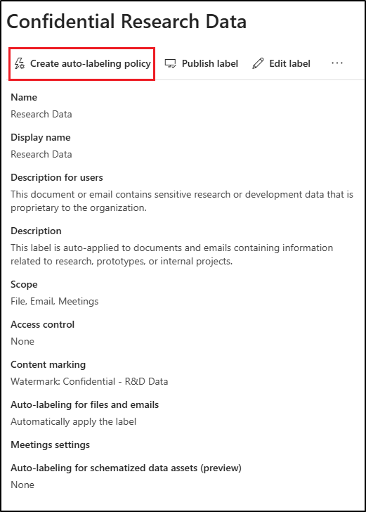

---
lab:
  task: Create and publish a sensitivity label
  exercise: Exercise 2 - Create and publish a sensitivity label
---

# 技能任务

你的任务是在组织内创建和发布敏感度标签，以根据敏感数据的保密级别和必要的访问控制对其进行分类和保护。

**任务**：

1. 启用对敏感度标签的支持  
1. 创建标签组  
1. 创建子标签  
1. 发布标签  
1. 配置自动标记  

## 任务 1 – 在 SharePoint 和 OneDrive 中启用对敏感度标签的支持

在此任务中，你将为敏感度标签启用共同创作，这也为 SharePoint 和 OneDrive 中的文件启用敏感度标签。

1. 打开 **Microsoft Edge**，然后导航到 `https://purview.microsoft.com`。

1. 在左侧导航中，选择“**设置**” > “**信息保护**”。

1. 在“**信息保护设置**”页上，确保你处于“**为使用敏感度标签的文件启用共同创作**”选项卡上。

1. 选中“**为使用敏感度标签的文件打开共同创作**”复选框。

1. 在屏幕底部，选择“**应用**”。

你已为 SharePoint 和 OneDrive 中的文件成功启用对敏感度标签的支持。

<!--

## Task 2 – Create sensitivity labels

In this task, your HR department has requested a sensitivity label to apply to HR employee documents. You'll create a sensitivity label for internal documents and a sublabel for the HR department.

1. Open **Microsoft Edge** and navigate to **`https://purview.microsoft.com`**. Log into Microsoft Purview as the user you selected as the **Compliance Administrator**.

1. In the Microsoft Purview portal, select **Solutions** from the left sidebar, then select **Information Protection**.

1. On the **Microsoft Information Protection** page, on the left sidebar, select **Sensitivity labels**.

1. On the **Sensitivity labels** page select **+ Create a label**.

1. The **New sensitivity label** configuration will start. On the **Provide basic details for this label**, enter:

    - **Name**: `Internal`
    - **Display name**: `Internal`
    - **Description for users**: `Internal sensitivity label.`
    - **Description for admins**: `Internal sensitivity label for Contoso.`

1. Select **Next**.

1. On the **Define the scope for this label** page, select **Items**, then select **Files** and **Emails**. If the checkbox for **Meetings** is selected, make sure it's deselected.

   > [!NOTE]
   > When **Meetings** is selected, you can't create a sublabel for the sensitivity label.

1. Select **Next**.

1. On the **Choose protection settings for labeled items** page, select **Next**.

1. On the **Auto-labeling for files and emails** page, select **Next**.

1. On the **Define protection settings for groups and sites** page, select **Next**.

1. On the **Auto-labeling for schematized data assets (preview)** page, select **Next**.

1. On the **Review your settings and finish** page, select **Create label**.

1. On the **Your sensitivity label was created** page, select **Don't create a policy yet**, then select **Done**.

1. On the **Sensitivity labels** page, find the newly created **Internal** sensitivity label. Select the vertical ellipsis (**...**) next to it, then select **+ Create sublabel** from the dropdown menu.

    

1. The **New sensitivity label** wizard will start. On the **Provide basic details for this label** page enter:

   - **Name**: `Employee data (HR)`
   - **Display name**: `Employee data (HR)`
   - **Description for users**: `This HR label is the default label for all specified documents in the HR Department.`
   - **Description for admins**: `This label was created with input from the Head of HR. Contact the HR department for any changes to the label settings.`

1. Select **Next**.

1. On the **Define the scope for this label** page, select **Items**, then select **Files**, **Emails**, and **Meetings**.

1. Select **Next**.

1. On the **Choose protection settings for labeled items** page, select the **Control access** option, then select **Next**.

1. On the **Access control** page, select **Configure access control settings**.

1. Configure the encryption settings with these options:

   - **Assign permissions now or let users decide?**: Assign permissions now
   - **User access to content expires**: Never
   - **Allow offline access**: Only for a number of days
   - **Users have offline access to the content for this many days**: 15
   - Select the **Assign permissions** link. On the **Assign permissions** flyout panel, select the **+ Add any authenticated users**, then select **Save** to apply this setting.

1. On the **Access control** page, select **Next**.

1. On the **Auto-labeling for files and emails** page, select **Next**.

1. On the **Define protection settings for groups and sites** page, select **Next**.

1. On the **Auto-labeling for schematized data assets (preview)** page, select **Next**.

1. On the **Review your settings and finish** page, select **Create label**.

1. On the **Your sensitivity label was created** page, select **Don't create a policy yet**, then select **Done**.

You have successfully created a sensitivity label for your organizations internal policies and a sensitivity sublabel for the Human Resources (HR) department.

## Task 3 – Publish sensitivity labels

You will now publish the Internal and HR sensitivity label so that the published sensitivity labels will be available for the HR users to apply to their HR documents.

1. In **Microsoft Edge**, the Microsoft Purview portal tab should still be open. If not, navigate to **`https://purview.microsoft.com`** > **Solutions** > **Information Protection** > **Sensitivity labels**.

1. On the **Sensitivity labels** page select **Publish labels**.

1. The publish sensitivity labels configuration will start.

1. On the **Choose sensitivity labels to publish** page, select the **Choose sensitivity labels to publish** link.

1. On the **Sensitivity labels to publish** flyout panel, select the **Internal** and **Internal/Employee Data (HR)** checkboxes, then select **Add** at the bottom of the flyout panel.

1. Back on the **Choose sensitivity labels to publish** page, select **Next**.

1. On the **Assign admin units** page, select **Next**

1. On the **Publish to users and groups** page, select **Next**.

1. On the **Policy settings** page, select **Next**.

1. On the **Default settings for documents** page, select **Next**.

1. On the **Default settings for emails** page, select **Next**.

1. On the **Default settings for meetings and calendar events** page, select **Next**.

1. On the **Default settings for Fabric and Power BI content** page, select **Next**.

1. On the **Name your policy** page, enter:

   - **Name**: `Internal HR employee data`
   - **Enter a description for your sensitivity label policy**: `This HR label is to be applied to internal HR employee data.`

1. Select **Next**.

1. On the **Review and finish** page, select **Submit**.

1. On the **New policy created**, select **Done** to finish publishing your label policy.

You have successfully published the Internal and HR sensitivity labels. Note that it can take up to 24 hours for changes to replicate to all users and services.

## Task 4 – Create a client-side auto labeling policy

In this task, you'll create a client-side auto-labeling policy. Client-side auto-labels apply automatically to files and emails based on their content, ensuring that sensitive information is classified and protected before it leaves the user's device.

1. You should still be on the **Sensitivity labels** page in the Microsoft Purview portal. If not, navigate to **`https://purview.microsoft.com`** > **Solutions** > **Information Protection** > **Sensitivity labels**.

1. On the **Sensitivity labels** page, find the newly created **Internal** sensitivity label. Select the vertical ellipsis (**...**) next to it, then select **+ Create sublabel** from the dropdown menu.

1. The **New sensitivity label** configuration will start. On the **Provide basic details for this label** page, enter:

   - **Name**: `Confidential Research Data`
   - **Display name**: `Confidential Research Data`
   - **Description for users**: `This document or email contains sensitive research or development data that is proprietary to the organization.`
   - **Description for admins**: `This label is auto-applied to documents and emails containing information related to research, prototypes, or internal projects.`

1. Select **Next**.

1. On the **Define the scope for this label** page, select **Items**, then select **Files**, **Emails**, and **Meetings**.

1. Select **Next**.

1. On the **Choose protection settings for labeled items** page, select **Apply content marking**, then select **Next**.

1. Select **Next**.

1. On the **Content marking** page, select the toggle to enable content marking.

1. If the checkbox for **Add a footer** is selected, deselect it, and select the checkbox for **Add a watermark**, then select **Customize text**.

1. In the **Customize watermark text** flyout pane, enter `Confidential - R&D Data` as **Watermark text**. Increase the **Font size** to `40`, then select **Save** at the bottom of the panel.

1. Back on the **Content marking** page, if other content marking options are enabled, disable them to ensure **Add a watermark** is the only option enabled.

1. Select **Next**.

1. On the **Auto-labeling for files and emails** page, set the **Auto-labeling for files and emails** to enabled.

1. In the **Detect content that matches these conditions** section, select **+ Add condition** > **Content contains**.

1. In **Content contains** section select the **Add** > **Trainable classifiers**.

1. In the **Trainable classifiers** flyout panel, add these trainable classifiers:

   - `Source code`
   - `Project documents`
   - `Software Product Development Files`

1. Select **Add** at the bottom of the panel to add these trainable classifiers.

1. Back on the **Auto-labeling for files and emails** page, select **Next**.

1. On the **Define protection settings for groups and sites** page, select **Next**.

1. On the **Auto-labeling for schematized data assets (preview)** page, select **Next**.

1. On the **Review your settings and finish** page, select **Create label**.

1. On the **Your sensitivity label was created** page, select **Publish label to users' apps**, then select **Done**.

1. On the **Publish label** flyout panel, select **Create new label policy**.

1. On the **Choose sensitivity labels to publish** page, select the **Choose sensitivity labels to publish** link.

1. Select the parent **Internal** label and the **Confidential Research Data** label that was just created, then select **Add**.

1. Back on the **Choose sensitivity labels to publish** page, select **Next**.

1. On the **Assign admin units** page, select **Next**.

1. On the **Publish to users and groups** page, select **Next**.

1. On the **Policy settings** page, select the checkbox for **Users must provide a justification to remove a label or lower its classification**, then select **Next**.

1. On the **Default settings for documents** page, select **Next** until you reach the **Name your policy** page.

1. On the **Name your policy** page, enter:

   - **Name**: `R&D Confidential Data Policy`
   - **Enter a description for your sensitivity label policy**: `Automatically applies labels to source code, project documents, and development files to protect sensitive R&D data.`

1. Select **Next**.

1. On the **Review and finish** page, select **Submit**.

1. On the **New policy created** page, select **Done**.

You have successfully created a client-side auto-labeling policy that will automatically apply the **Confidential Research Data** label to files and emails containing research and development data. It might take up to 24 hours for the policy to take full effect.

## Task 5 – Create a service-side auto labeling policy

In this task, you'll create a service-side auto-labeling policy. Service-side auto-labels are applied by cloud services like SharePoint, Exchange, and OneDrive after content is uploaded or received, ensuring that sensitive data is protected even if users don't manually classify it.

1. You should still be on the **Sensitivity labels** page in the Microsoft Purview portal. If not, navigate to **`https://purview.microsoft.com`** > **Solutions** > **Information Protection** > **Sensitivity labels**.

1. Expand the **Internal** label, then select the `Confidential Research Data` sublabel you created in a previous task.

1. In the **Confidential Research Data** flyout panel, you'll see the properties for the auto-label you created in a previous task. In this panel, select **Create auto-labeling policy**.

    

1. On the **Name your policy** page, enter:

   - **Name**: `R&D Confidential Data Container Policy`
   - **Enter a description for your sensitivity label policy**: `Automatically applies the Confidential Research Data label to content in SharePoint, Exchange, and OneDrive.`

1. Select **Next**.

1. On the **Assign admin units** page, select **Next**.

1. On the **Choose locations where you want to apply the label** page, leave **Exchange email**, **SharePoint sites**, and **OneDrive accounts** selected, then select **Next**.

1. On the **Set up common or advanced rules** page, leave **Common rules** selected, then select **Next**.

1. On the **Define rules for content in all locations** page, edit the **Confidential Research Data rule**.

    

1. In the **New rule** flyout panel, under **Conditions** > **Content contains** select the dropdown for **Add**, then select **Trainable classifiers**.

1. In the **Trainable classifiers** flyout panel, add these trainable classifiers:

   - `Source code`
   - `Project documents`
   - `Software Product Development Files`

   This ensures consistent protection between client-side and service-side labels.

1. Select **Add** at the bottom of the panel to add these trainable classifiers.

1. Back on the **Define rules for content in all locations** page, select **Next**.

1. On the **Choose a label to auto-apply**, leave the **Internal/Confidential Research Data** chosen, then select **Next**.

1. On the **Decide if you want to test out the policy now or later** page, select **Run policy in simulation mode**, and select the checkbox for **Automatically turn on policy if not modified after 7 days in simulation**, then select **Next**.

1. On the **Review and finish** page, select **Create policy**.

1. On the **Your auto-labeling policy was created** page, select **Done**.

You have successfully created a service-side auto-labeling policy that will automatically apply the **Confidential Research Data** label to content stored or shared in SharePoint, Exchange, and OneDrive. It might take up to 24 hours for the policy to take effect.

-->
## 任务 2 – 创建标签组

在此任务中，你将创建一个标签组来组织内部敏感度标签。 标签组充当相关标签的容器，例如部门或业务单位分类。

1. 你应仍以合规性管理员身份登录到 Microsoft Purview 门户。

1. 在“Microsoft Edge”中，导航到 。

1. 在 Microsoft Purview 门户中的左侧边栏中选择“**解决方案**”，然后选择“**信息保护**”。

1. 在“**Microsoft 信息保护**”页上的左侧边栏中，选择“**敏感度标签**”。

1. 在“敏感度标签”页上，选择“+ 创建” > “标签组”。************

1. “新建标签组”配置将启动。**** 在“提供此标签组的基本详细信息”页上，输入以下内容：****

    - **名称**：`Internal`
    - **显示名称**：`Internal`
    - **** 面向用户的说明：`Internal sensitivity label.`
    - **** 面向管理员的说明：`Internal sensitivity label group for Contoso.`

1. 选择**下一步**。

1. 在“查看设置并完成”页上，选择“创建标签组”。********

1. 在“已成功创建标签组”页上，选择“尚未创建标签”，然后选择“完成”。************

已创建标签组供内部使用。 此组可帮助你管理特定部门或数据类别的相关标签。

## 任务 3 – 创建子标签

现在你已经创建了一个标签组，接下来将为与 HR 相关的内容添加一个子标签。 此标签会强制实施加密和内容标记，以保护 HR 数据免受未经授权的访问。

1. 在“敏感度标签”页上，找到“内部”敏感度标签组。******** 选择旁边的垂直省略号 (...)，然后从下拉菜单中选择“+ 在组中创建标签”。********

    

1. 此时会启动“新建敏感度标签”向导。 在“**提供此标签的基本详细信息**”页中，输入：

   - **名称**：`Employee data (HR)`
   - **显示名称**：`Employee data (HR)`
   - **** 面向用户的说明：`This HR label is the default label for all specified documents in the HR Department.`
   - **** 面向管理员的说明：`This label is created in consultation with Ms. Jones (Head of the HR department). Contact her if you need to change the label settings.`

1. 选择**下一步**。

1. 在“**定义此标签的范围**”页上，选择“**文件**”和“**电子邮件**”。 如果已选中“**会议**”复选框，请确保将其取消选中。

1. 选择**下一步**。

1. 在“**选择带标签项的保护设置**”页上，选择“**控制访问**”和“**应用内容标记**”选项，然后选择“**下一步**”。

1. 在“**访问控制**”页上，选择“**配置访问控制设置**”。

1. 使用以下选项配置加密设置：

   - **立即分配权限或让用户自行决定?** ：立即分配权限
   - **用户对内容的访问权限过期**：从不
   - **允许脱机访问**：仅几天
   - **用户在多少天内可以脱机访问内容**:15
   - 选择“**分配权限**”链接。 在“分配权限”浮出控件面板上，选择“+ 添加任何经过身份验证的用户”，然后选择“保存”以应用此设置。************

1. 在“访问控制”页上，选择“下一步”********。

1. 在“**内容标记**”页上，选择切换以启用“**内容标记**”。

1. 对于以下每种标记类型，请选中该复选框，然后选择编辑图标以输入文本：

   |标记类型|文本|
   |:---|:---|
   |添加水印|`INTERNAL USE ONLY`|
   |添加标题|`Internal Document`|
   |添加页脚|`Contoso Confidential`|

1. 选择**下一步**。

1. 在“自动标记文件和电子邮件”页面上，选择“下一步” 。

1. 在“定义组和网站的保护设置”页面上，选择“下一步” 。

1. 在“查看设置并完成”页面上，选择“创建标签” 。

1. 在“你的敏感度标签已创建”页上，选择“现在不创建策略”，然后选择“完成”。************

你已经在“内部”标签组中创建了一个子标签。 该标签将加密和内容标记应用于 HR 文档，使敏感数据易于识别并受策略保护。

## 任务 4 – 发布标签

接下来，你将从“内部”标签组发布 HR 标签，以便 HR 部门中的用户可以将其应用于自己的文档。

1. 你应仍以合规性管理员身份登录到 Microsoft Purview 门户。

1. 在 Microsoft Edge 中，Microsoft Purview 门户选项卡应该仍处于打开状态。 如果没有，请导航到“**`https://purview.microsoft.com`**” > “**解决方案**” > “**信息保护**” > “**敏感度标签**”。

1. 在“**敏感度标签**”页上，选择“**发布标签**”。

1. 此时会启动“发布敏感度标签”配置。

1. 在“选择要发布的敏感度标签”页面上，选择“选择要发布的敏感度标签”链接 。

1. 在“要发布的敏感度标签”浮出控件面板上，选中“内部/员工数据(HR)”复选框，然后选择浮出控件页面底部的“添加”。************

1. 返回“**选择要发布的敏感度标签**”页面上，选择“**下一步**”。

1. 在“分配管理单元”**** 页面上，选择“下一步”****

1. 在“发布到用户和组”页面上，选择“下一步” 。

1. 在“策略设置”页面上，选择“下一步” 。

1. 在“文档的默认设置”中，选择“下一步” 。

1. 在“电子邮件的默认设置”中，选择“下一步” 。

1. 在“会议和日历活动的默认设置”中，选择“下一步” 。

1. 在“**Fabric 和 Power BI 内容的默认设置**”页上，选择“**下一步**”。

1. 在“**为策略命名**”页上输入：

   - **名称**：`Internal HR employee data`

   - **** 输入有关敏感度标签策略的说明：`This HR label is to be applied to internal HR employee data.`

1. 选择**下一步**。

1. 在“查看并完成”页面上，选择“提交” 。

1. 在“**已创建新策略**”页上，选择“**完成**”，以完成标签策略的发布。

你已发布“内部”标签组及其 HR 标签，使用户可以将其应用于 HR 文档。 策略在各项服务中完成传播可能需要 24 小时。

## 任务 5 – 配置自动标记

现在，你将为财务数据创建一个子标签，并将其配置为自动应用于包含财务标识符（如信用卡号或银行路由号）的内容。

1. 你应仍以合规性管理员身份登录到 Microsoft Purview 门户。

1. 在 Microsoft Edge 中，导航到 `https://purview.microsoft.com`，并以合规性管理员身份登录到 Microsoft Purview 门户。****

1. 在 Microsoft Purview 门户中，选择“解决方案” > “信息保护” > “敏感度标签”。************

1. 在“**敏感度标签**”页上，找到“**内部**”敏感度标签。 选择垂直省略号 (...)，然后从下拉菜单中选择“+ 在组中创建标签”。********

1. 在“**提供此标签的基本详细信息**”页中，输入：

   |详细信息|文本|
   |---|---|
   |**Name**|`Financial Data`|
   |**显示名称**|`Financial Data`|
   |**用户说明**|`This content contains financial data that must be labeled and protected.`|
   |**管理员说明**|`This label is used for content that includes sensitive financial identifiers.`|

1. 选择**下一步**。

1. 在“**定义此标签的范围**”页上，选择“**文件**”和“**电子邮件**”。 如果已选中“**会议**”复选框，请确保将其取消选中。

1. 选择**下一步**。

1. 在“选择带标签项的保护设置”页面上，选择“下一步” 。

1. 在“自动标记文件和电子邮件”页面上，将“自动标记文件和电子邮件”设置为“已启用” 。

1. 在“**检测符合这些条件的内容**”部分，选择“**+ 添加条件**” > “**内容包含**”。

1. 在“内容包含”部分中，选择“添加” > “敏感信息类型”。************

1. 在“**敏感信息类型**”浮出控件页中，搜索并选择以下敏感信息类型：

   - `Credit Card Number`
   - `ABA Routing Number`
   - `SWIFT Code`

1. 选择 **添加** 。

1. 在“自动标记文件和电子邮件”**** 页面上，选择“下一步”****。

1. 在“定义组和网站的保护设置”页面上，选择“下一步” 。

1. 在“查看设置并完成”页面上，选择“创建标签” 。

1. 在“**创建敏感度标签**”页上，选择“**自动将标签应用于敏感内容**”，然后选择“**完成**”。

1. 在“**创建自动标记策略**”浮出控件页上，选择“**查看策略**”。

1. 在“**为自动标记策略命名**”页上，保留默认值，然后选择“**下一步**”。

1. 在“**选择要自动应用的标签**”页上，查看以确保选择“_内部/财务数据_”标签，然后选择“**下一步**”。

1. 在“分配管理单元”**** 页面上，选择“下一步”****。

1. 在“**选择要应用标签的位置**”页上，选择以下选项：

   - Exchange 电子邮件
   - SharePoint 站点
   - OneDrive 帐户

1. 选择**下一步**。

1. 在“**设置通用或高级规则**”页上，保留默认选择“**通用规则**”，然后选择“**下一步**”。

1. 在“**定义所有位置中的内容规则**”页上，展开“_财务数据规则_”的规则，以确保定义预期的规则，然后选择“**下一步**”。

1. 在“**电子邮件的其他默认设置**”页上，选择“**下一步**”。

1. 在“**决定是现在测试策略还是稍后测试策略**”页上，选择“**在模拟模式下运行策略**”，然后选中“**在模拟中未修改达 7 天时自动启用策略**”的复选框。

1. 选择**下一步**。

1. 在“查看并完成”页上，选择“创建策略” 。

1. 在“你的自动标记策略已创建”页上，选择“完成”。********

你已组织组中的标签，将其发布到用户，并启用了自动标记，这样敏感内容就可以受到保护，而无需依赖用户。
