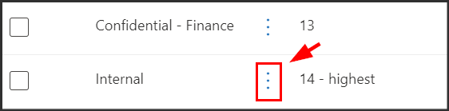

---
lab:
  task: Create and publish a sensitivity label
  exercise: Exercise 2 - Create and publish a sensitivity label
---

# 技能任务

你的任务是在组织内创建和发布敏感度标签，以根据敏感数据的保密级别和必要的访问控制对其进行分类和保护。

- **** 创建敏感度标签以对数据进行分类。
- **** 在父标签下创建一个子标签以对数据进行分组。
- **** 创建标签策略，以建立用来管理组织中的敏感度标签的规则和准则。

**** 目标：创建并发布敏感度标签，以改善人力资源部门的数据保护。 你的任务是设置一个名为“内部”的父标签，且其带有一个名为“员工数据 (HR)”的子标签____。

## 任务 1 - 创建敏感度标签

1. 导航到 Microsoft Purview 合规性门户。
1. 展开“信息保护”，然后选择“标签”。********
1. 在“标签”页上选择“+ 创建标签”。********
1. 在“提供此标签的基本详细信息”**** 上输入以下信息：

    - **名称**：`Internal`
    - **显示名称**：`Internal`
    - **** 面向用户的说明：`Internal sensitivity label.`
    - **** 面向管理员的说明：`Internal sensitivity label for Contoso.`

1. 选择**下一步**。
1. 在“定义此标签的作用域”页上选择“项”，选择“文件”和“电子邮件”，然后选择“下一步”。********************
1. 在“为你选择的项类型选择保护设置”页上，选择“下一步”。********
1. 选择“下一步”并接受默认值，直至到达“复查设置并完成”页面，然后选择“创建标签”。************
1. 在“你的敏感度标签已创建”页上，选择“现在不创建策略”，然后选择“完成”。************

## 任务 2 - 创建子标签标签

1. 在“信息保护”页上，突出显示（无需选择）新创建的内部标签，然后选择纵向的“...”。********
1. 从菜单中选择“+ 创建子标签”****。
1. 在“提供此标签的基本详细信息”**** 上输入以下信息：

   - **名称**：`Employee data (HR)`
   - **显示名称**：`Employee data (HR)`
   - **** 面向用户的说明：`This label is the default label for all documents in the HR Department.`
   - **** 面向管理员的说明：`This label is created in consultation with the Director of HR.`
1. 选择**下一步**。
1. 在“定义此标签的作用域”页上选择“项”，选择“文件”和“电子邮件”，然后选择“下一步”。********************
1. 在“为你选择的项类型选择保护设置”上，选中“控制访问”复选框，然后选择“下一步”************。
1. 在“访问控制”**** 页上：
   - 确保选中“配置访问控制设置”单选按钮****。
   - 在“立即分配权限，还是让用户自行决定?”下，选择“立即分配权限”********。
   - 在“用户对内容的访问权限过期”下，选择“永不”********。
   - 在“允许脱机访问”下选择“仅数天”********。
   - 在“用户在以下天数内对内容具有脱机访问权限”字段中输入 14****。
   - 在“向特定用户和组分配权限”******** 下选择“分配权限”按钮。
1. 在“分配权限”页上，选择“+ 添加任何经过身份验证的用户”，然后选择“保存”************。
1. 返回“访问控制”页，选择“下一步”********。
1. 选择“下一步”并接受默认值，直至到达“复查设置并完成”页面，选择“创建标签”。************
1. 在“你的敏感度标签已创建”页上，选择“现在不创建策略”，然后选择“完成”。************

## 任务 3 - 发布敏感度标签

1. 在“标签”页上，选中新创建的“内部”标签以及“员工数据 (HR)”子标签旁边的复选框************。
1. 在“选择要发布的敏感度标签”页面上，确保“内部”和“员工数据 (HR)”标签都显示在“要发布的敏感度标签”下，然后选择“下一步”************。
1. 选择“下一步”，直到到达“策略设置”页面********。
1. 在“策略设置”页面上，选中“用户必须提供移除标签或降低其分类的理由”复选框********。
1. 选择“下一步”，直到到达“命名策略”页面********
1. 在“为策略命名”页面上，输入以下信息：

   - **名称**：`Internal HR employee data`
   - **** 输入有关敏感度标签策略的说明：`This HR label is to be applied to internal HR employee data.`

1. 选择**下一步**。
1. 在“查看并完成”页上，选择“提交”********。
1. 在“新策略已创建”页上，选择“完成” 。

现已成功创建用于对 HR 部门的员工数据进行分类的敏感度标签。
